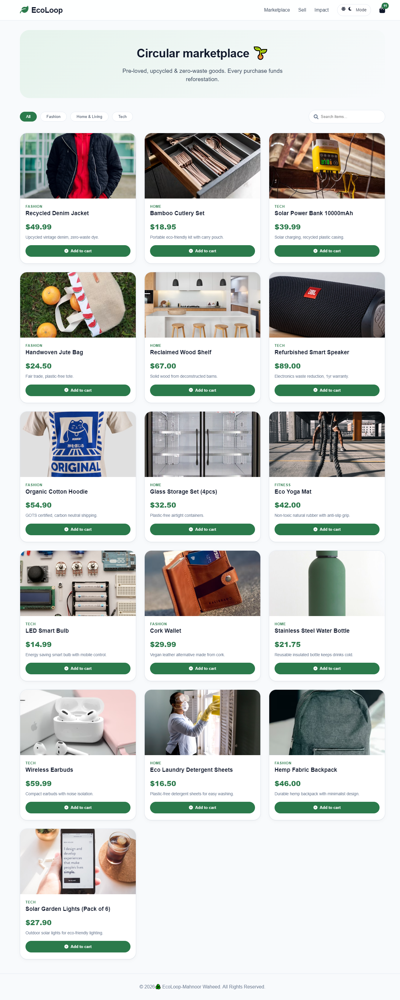
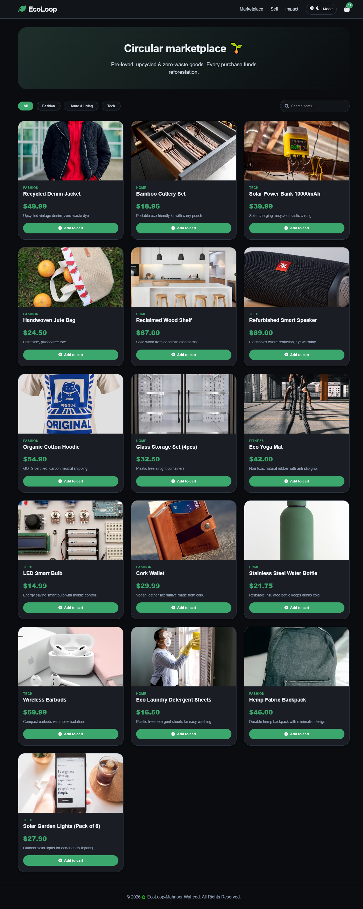
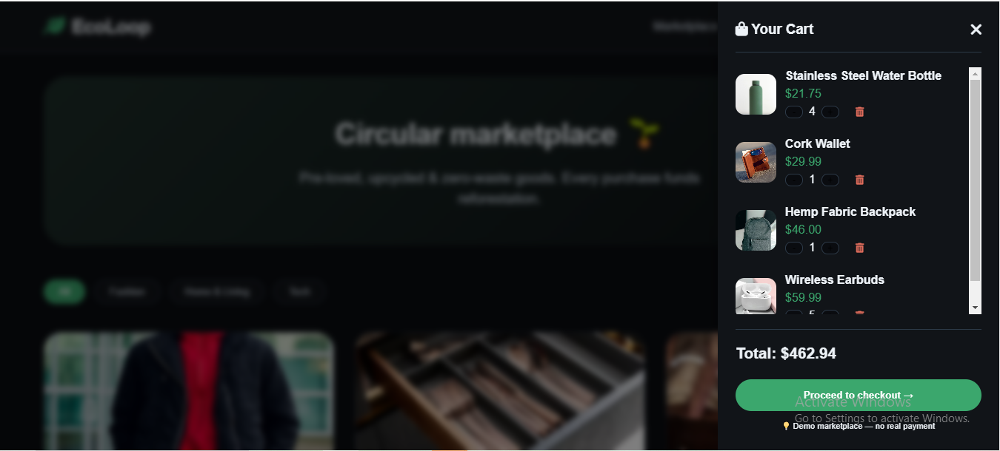

# 🌿 Ecoloop Marketplace

🌐 **Live Demo:**  
👉 [Click Here to Visit 🚀](https://mahnoorwaheed-dev.github.io/ecoloop-marketplace/)

---

## 📸 Preview

### 🌞 Light Mode

### 🌙 Dark Mode

### 🛒 Sidebar Cart

---

## 🧾 Overview

**Ecoloop Marketplace** is a modern and interactive eCommerce web application designed to deliver a smooth and engaging shopping experience.

It features a clean UI, responsive layout, and dynamic functionalities that simulate a real-world marketplace environment.

---

## ✨ Key Features

### 🛍️ Dynamic Product Listing
- Products displayed in a structured and clean layout  
- Real-time UI updates  

### 📂 Category Filtering
- Filter products by:
  - Fashion  
  - Home  
  - Tech  

### 🔍 Product Search
- Instantly search and find products  

### 🧮 Smart Sidebar Cart
- Products added dynamically  
- Items appear one by one in sidebar  
- Real-time total price calculation  

### 🌗 Light & Dark Mode
- Smooth theme switching  
- Better user experience  

### 📱 Responsive Design
- Fully optimized for:
  - Mobile  
  - Tablet  
  - Desktop  

---

## 🛠️ Tech Stack

- HTML5  
- CSS3  
- JavaScript (Vanilla)  

---

## 🚀 How It Works

1. Browse products from different categories  
2. Use filters or search to find items quickly  
3. Add products to cart → sidebar updates instantly  
4. View total price in real-time  
5. Toggle between light and dark mode  

---

## 🎯 Purpose

This project highlights strong frontend development skills:

- UI/UX Design  
- DOM Manipulation  
- Cart Logic Handling  
- Responsive Layouts  
- Interactive Features  

---

## 📌 Future Improvements

- 💳 Payment Integration  
- 🔐 User Authentication  
- 🗄️ Backend / Database Support  
- ❤️ Wishlist Feature  

---

## 💡 Author

**Mahnoor Waheed**  
Frontend Developer 🚀
